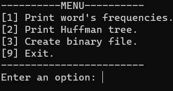
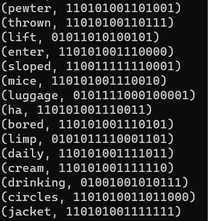
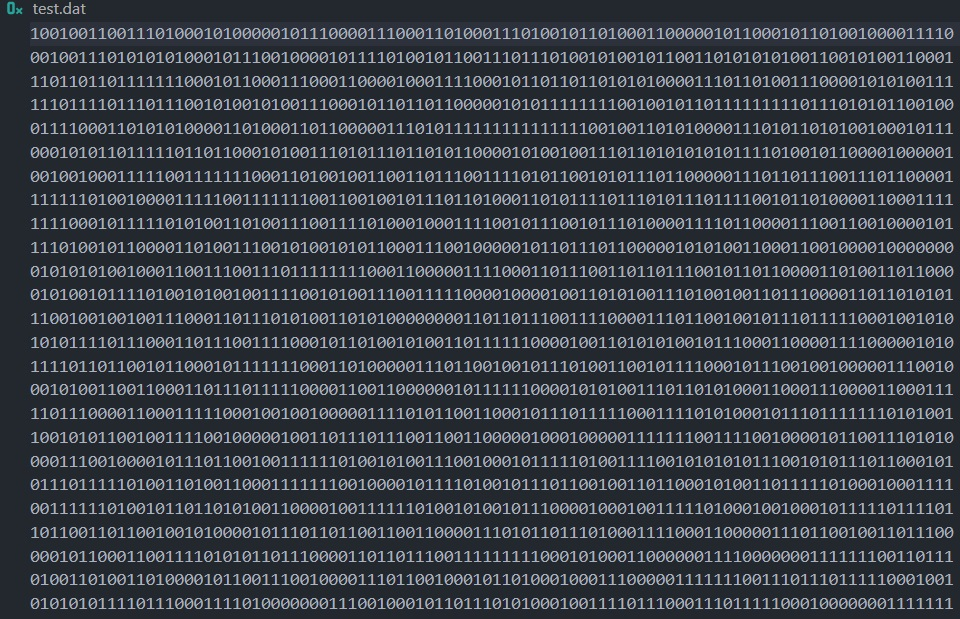
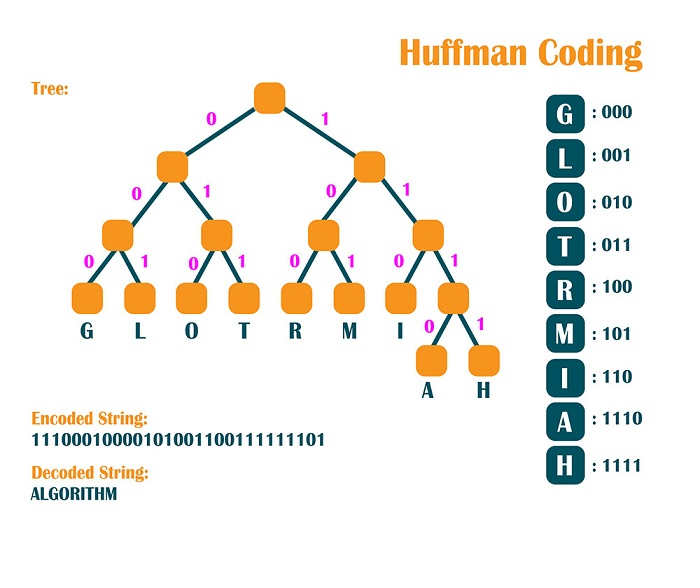

# Huffman Coding Project

## Index

__1.__ [Introduction](#introduction)

__2.__ [Methodology](#methodology)

__3.__ [Menu](#menu)

__4.__ [Results Discussion](#results-discussion)

__5.__ [Compilation and Execution](#compilation-and-execution)

## Introduction

    This project consists of developing a terminal application using the C++ language. Through data structures, it was proposed to create a data compression method using Huffman coding. Huffman coding is a compression method that uses the occurrence probabilities of symbols in the data set to be compressed to determine variable-length codes for each symbol.    

## Methodology

    For the use of coding, tree structures, queues, lists and hash tables were used. A priority queue was created to handle the reordering of the forest of trees that was contained in a list of trees. Below are the project steps and their respective codes.

### Project Steps

__1.__ [Count the recurrence of each word in the file;](https://github.com/diegohat/huffman/blob/main/src/tree.cpp#L41)

__2.__ [Normalize the count;](https://github.com/diegohat/huffman/blob/main/src/tree.cpp#L49)

__3.__ [Build the tree with the rules presented by Huffman;](https://github.com/diegohat/huffman/blob/main/src/tree.cpp#L95)

__4.__ [Replace words with binary encoding;](https://github.com/diegohat/huffman/blob/main/src/tree.cpp#L62)

__5.__ [Save the file in binary format;](https://github.com/diegohat/huffman/blob/main/src/tree.cpp#L138)

__6.__ [Observe and discuss space gain or loss.](#results-discussion)

## Menu

- When executing the program, the following options will appear:
    - `1` Prints the list of words from the text and their normalized frequencies.
    - `2` Prints the Huffman tree (in list form) with their associated binary values.
    - `3` Creates the binary file test.dat in the /src directory.
    - `9` Ends the program.

- Expected results from executing the options:

    - ### [1] Print word's frequencies.
        
        (Word, Normalized Frequency)

        

    - ### [2] Print Huffman tree.

        (Word, Binary Value)

        

    - ### [3] Create binary file.

        

    - ### [9] Exit.

        

## Results Discussion

    Through the analysis of the compression result, it was possible to identify an increase in file size. This behavior, contrary to what was expected, is due to the fact that the true Huffman code (different from the proposed one) uses characters as keys for building the tree and their respective binary values. The number of characters is much lower than the number of possible words within a text, causing the binary values to grow in such a way (due to the number of words and the code having no repeated prefixes) that the file size increases.

## Compilation and Execution

| Command    | Function                                                                                  |
| ---------- | --------------------------------------------------------------------------------------- |
| make clean | Deletes the last compilation performed contained in the build folder                     |
| make       | Executes the program compilation using g++, and the result goes to the build folder     |
| make run   | Executes the program from the build folder after compilation is performed               |
