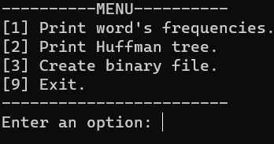
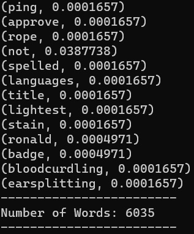
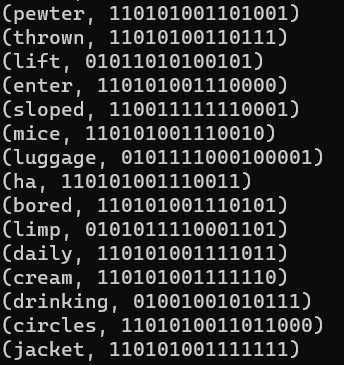
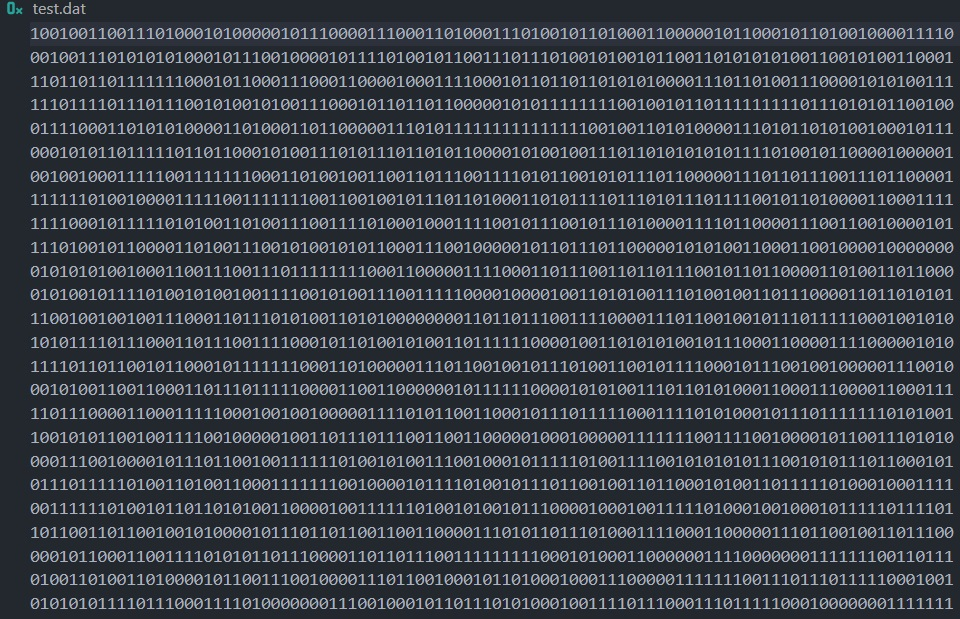
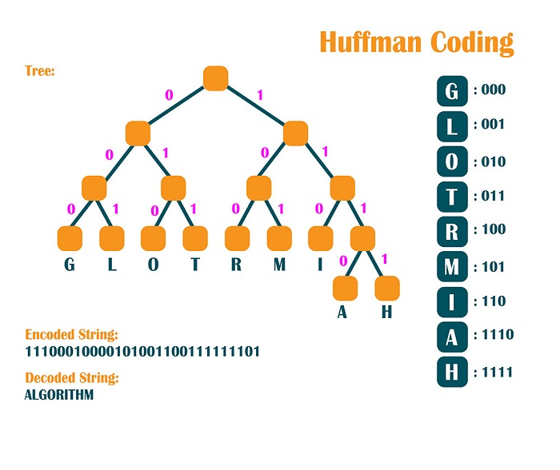

# Trabalho sobre o Código de Huffman

## Índice

__1.__ [Introdução](#introdução)

__2.__ [Metodologia](#metodologia)

__3.__ [Menu](#menu)

__4.__ [Discussão dos Resultados](#discussão-dos-resultados)

__5.__ [Compilação e Execução](#compilação-e-execução)

## Introdução

    Este trabalho consiste no desenvolvimento de uma aplicação em terminal utilizando a linguagem C++. Através de estrutura de dados foi proposto a criação de um método de compressão de dados fazendo uso da codificação de Huffman. A codificação de Huffman é um método de compressão que usa as probabilidades de ocorrência dos símbolos no conjunto de dados a ser comprimido para determinar códigos de tamanho variável para cada símbolo.    

## Metodologia

    Para o uso da codificação, foram utilizadas estruturas em árvore, filas, listas e tabelas hash. Uma fila de prioridade foi criada para lidar com a reordenação da floresta de árvores que estava contida em uma lista de árvores. Abaixo segue as etapas do projeto e seus respectivos códigos.

### Etapas do projeto

__1.__ [Contabilizar a recorrência de cada palavra no arquivo;](https://github.com/diegohat/huffman/blob/main/src/tree.cpp#L41)

__2.__ [Normalizar a contabilização;](https://github.com/diegohat/huffman/blob/main/src/tree.cpp#L49)

__3.__ [Montar a árvore com as regras apresentadas por Huffman;](https://github.com/diegohat/huffman/blob/main/src/tree.cpp#L95)

__4.__ [Trocar as palavras pela codificação binária;](https://github.com/diegohat/huffman/blob/main/src/tree.cpp#L62)

__5.__ [Salvar o arquivo em formato binário;](https://github.com/diegohat/huffman/blob/main/src/tree.cpp#L138)

__6.__ [Observar e discutir sobre o ganho ou perda de espaço.](#discussão-dos-resultados)

## Menu

- Ao executar o programa surgirão as seguintes opções:
    - `1` Imprime a lista de palavras do texto e suas frequências normalizadas.
    - `2` Imprime a árvore de huffman (em lista) com seus valores associados em binário.
    - `3` Cria o arquivo binário test.dat no diretório /src .
    - `9` Finaliza o programa.

- Resultados esperados pela execução das opções:

    - ### [1] Print word's frequencies.
        
        (Palavra, Frequencia Normalizada)

        

    - ### [2] Print Huffman tree.

        (Palavra, Valor Binário)

        

    - ### [3] Create binary file.

        

    - ### [9] Exit.

        

## Discussão dos Resultados

    Através da análise do resultado da compressão foi possível identificar um aumento no tamanho do arquivo. Esse comportamento, contrário ao esperado, se deve devido ao código de Huffman verdadeiro (diferente do proposto) utilizar de caracteres como chaves para a construção da árvore e de seus respectivos valores binários. A quantidade de caracteres é muito inferior a quantidade de palavras possíveis dentro de um texto, fazendo com que os valores binários cresçam de tal maneira (devido a quantidade de palavras e o código não ter prefixos repetidos) que o tamanho do arquivo cresça.

## Compilação e Execução

| Comando    | Função                                                                                  |
| ---------- | --------------------------------------------------------------------------------------- |
| make clean | Apaga a última compilação realizada contida na pasta build                              |
| make       | Executa a compilação do programa utilizando o g++, e o resultado vai para a pasta build |
| make run   | Executa o programa da pasta build após a realização da compilação                       |